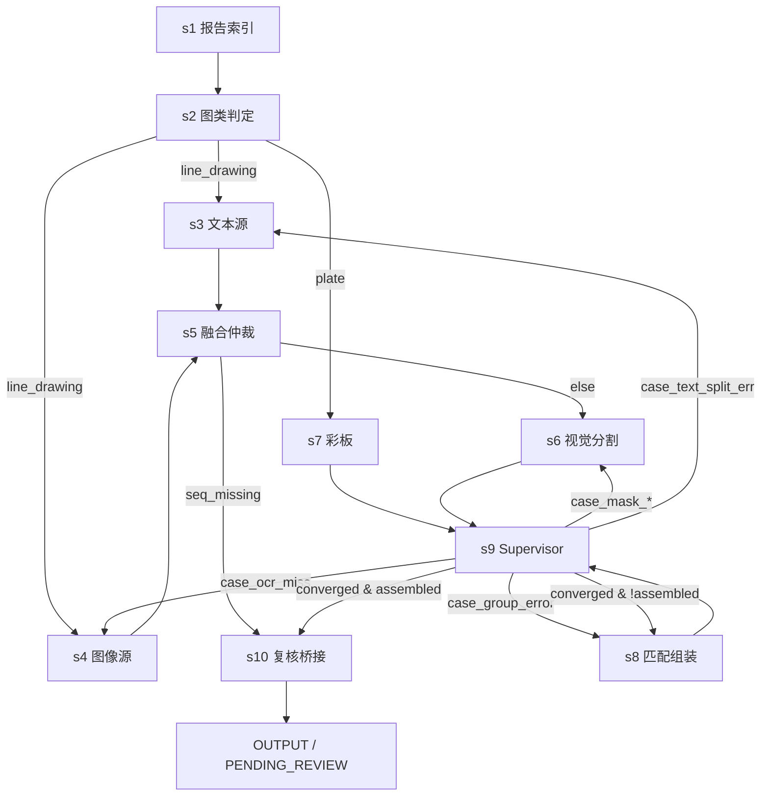

# ArchaeoPairs

考古报告图文 Pair 数据构造多智能体管线。以《考古报告图文Pair数据构造_多智能体方案 V0.2》为唯一设计依据，采用 **LangGraph** 编排，实现"大图拆小图、图文配对、异常闭环"，产出（器物号, 图像, 描述文本）三元组语料。

## 架构

Supervisor-Worker 范式：S1–S10 十个智能体映射为 LangGraph StateGraph 节点，诊断驱动条件边回环（S6→S9→S6），checkpointer 断点续跑，interrupt 人工复核。



## 环境要求

- Python >= 3.11
- 依赖见 `pyproject.toml`（锁定）与 `requirements.lock`

## 快速开始

```bash
python -m venv .venv
.venv/Scripts/python -m pip install -e ".[dev]"   # Windows
# 或: .venv/bin/python -m pip install -e ".[dev]"  # Linux/macOS
.venv/Scripts/python -m pytest                    # 运行测试
```

跑批（P0，mock 能力接口）：

```bash
.venv/Scripts/python -m archaeopairs.cli run-book --book 郑州商城 --examples examples/
```

## 目录结构

```
src/archaeopairs/
  state.py               # pydantic v2 State/数据契约（§6.1）
  errors.py              # E-code 异常体系（§6.4）
  gateway.py             # 模型网关：录制/回放/限流/熔断/成本帽（§9.1）
  capability/            # VLM/SAM/OCR 抽象 + mock 实现
  parsers/               # S1 XML / S3 图注(策略注册) / S3 正文
  agents/                # S1–S10 智能体模块
  orchestration/         # graph.py(StateGraph) / nodes.py / routing.py
  storage/               # SQLAlchemy 模型 + 对象存储
  schemas/               # JSON Schema 契约
  config/                # thresholds/flags 加载
tests/                   # 三层测试
ddl.sql                  # PostgreSQL DDL（§6.5）
config/*.example.yaml    # 配置样例（真实配置不入库）
```

## 配置

复制样例后编辑（真实配置不提交）：

```bash
cp config/thresholds.example.yaml config/thresholds.yaml
cp config/flags.example.yaml config/flags.yaml
```

## 数据与模型

- 示例数据 `examples/` 仅含脱敏 XML；media/原图与模型权重不入库，经对象存储/HuggingFace 获取。
- 能力接口（VLM/SAM/OCR）为抽象层，P0 用 `capability/mock.py`，生产可替换 transformers 实现。

## License

见 [LICENSE](LICENSE)（MIT 占位，正式由项目方在 Apache-2.0/MIT 间确认）。
