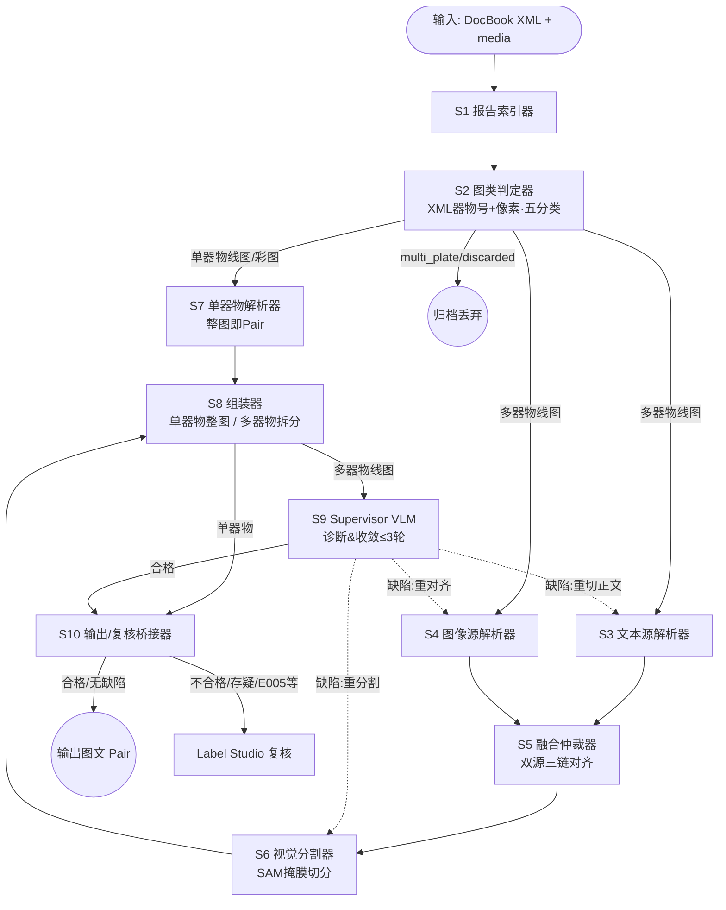

# ArchaeoPairs 技术方案 V0.5 —— 功能差异与变更

> **基线**：`V0.4.1`（文档：`考古报告图文Pair数据构造_多智能体方案_V0.4.1.docx`；判定口径：XML 器物号 + 像素家族 + 拓图词组合 + S1 ground 与运行时一致）
> **本文档**：V0.4.1 → V0.5 的功能差异对比与变更落点；正式 V0.5 定本见 `考古报告图文Pair数据构造_多智能体方案_V0.5.docx`。
> 日期：2026-08-18

---

## 一、V0.4.1 → V0.5 功能差异对照

| # | 维度 | V0.4.1 现状 | V0.5 变更 | 落点 |
|---|---|---|---|---|
| 1 | **单器物（线图/彩图）编排拓扑** | `S1→S2→S7→S8→S9→S10`（S9 对每图必做终检） | **`S1→S2→S7→S8→S10`**（整图即 Pair，不经 S9；省去单器物监督开销） | `routing.route_assemble`、`graph.py` |
| 2 | **多器物线图编排拓扑** | `S3/S4→S5→S6→S9→S8`（S9 先诊断后组装） | **`S3/S4→S5→S6→S8→S9→S10`**（S6→S8 先组装、S8→S9 监督终检） | `graph.py`（`segment→assemble`，S8 条件边） |
| 3 | **S8 分流节点** | 无；assemble 恒 → supervise | 新增 **`route_assemble`**：`PENDING_REVIEW→复核`；`单器物→S10`；`多器物线图→S9` | `routing.py` |
| 4 | **S9 适用路径** | 全部 figure 必做终检 | **仅多器物线图路径**走 S9（单器物不经） | `routing.py`、`graph.py` |
| 5 | **S10 输出/复核两级** | S9→S10→PENDING_REVIEW / 合格→OUTPUT（未显式两路） | **S10 显式两级**：合格/无缺陷→输出 Pair；不合格/存疑（含 E005 等）→ **Label Studio 复核** | `graph.py`、README/附录B mermaid |
| 6 | **运行范围（试点）** | 全类别 | **multi_line 临时 `multi_line_skipped`**，先在单器物线图/彩图、multi_plate、discarded 上验证 | `s2.py`（临时分支）、`route_classify`（分发分支注释保留） |

## 二、V0.5 编排拓扑（LangGraph）

- **单器物（线图/彩图）**：`S1 → S2 → S7 → S8 → S10`
- **多器物线图**：`S1 → S2 → S3/S4(平行) → S5 → S6 → S8 → S9 → S10`
- **非器物（multi_plate / discarded）**：`→ 归档`
- **S10 两级**：合格/无缺陷 → 输出 Pair；不合格/存疑 → Label Studio 复核

## 三、实机验证（V0.5 试运行，其它类别）

- **门禁**：ruff / mypy 全绿；`pytest` **148 passed / 3 skipped**（skip 的 3 个为 multi_line 专属路径测试：`test_review::e006`、`test_graph::end_to_end_output/checkpointer`）。
- **单器物路径（新拓扑，不经 S9）**：真实书实测——洪洞 `OUTPUT=17`、大兴 `OUTPUT=7`，直接产出 Pair，无需 VLM。
- **multi_line**：临时归档 `multi_line_skipped`（可统计、可恢复）。

## 四、代码/测试/文档落点

| 文件 | 变更 |
|---|---|
| `src/archaeopairs/orchestration/routing.py` | 新增 `route_assemble`（S8 分流） |
| `src/archaeopairs/orchestration/graph.py` | `segment→assemble`、`assemble` 条件边 `{supervise, bridge_review}` |
| `src/archaeopairs/agents/s2.py` | multi_line 临时 skip（`multi_line_skipped`） |
| `tests/test_routing.py` | 新增 `test_route_assemble` |
| `README.md` | 架构图/拓扑描述 + mermaid 同步 |
| `docs/V0.5_技术方案_功能差异与变更.md` | 本文档 |
| `docs/考古报告图文Pair数据构造_多智能体方案_V0.5.docx` | 正式 V0.5 定本（由 V0.4.1.docx 内联修订） |

## 五、说明
- 多器物线图路径的 `S6→S8→S9` 重排与 S9 仅用于多器物，均为**恢复 multi_line 后生效**；当前 multi_line 仍为 `multi_line_skipped`。
- 单器物路径不再依赖 S9/VLM，运行依赖进一步收敛（见运行章节：仅需 VLM 于多器物监督路径）。